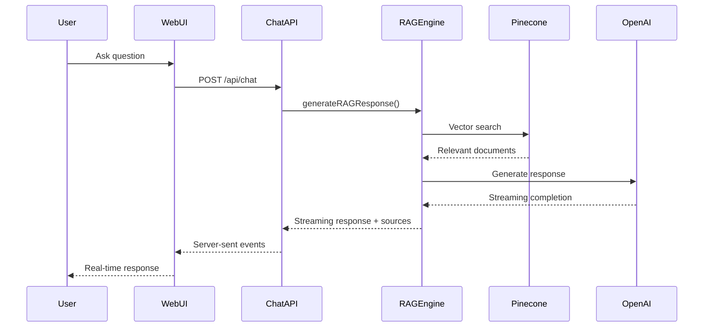
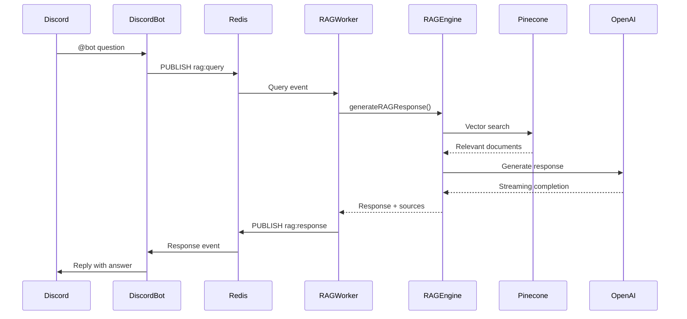

# RAG System Architecture

> 🏗️ **Technical architecture overview of the dual-mode Inngest RAG system**  
> Understanding the system design, data flow, and component interactions.

## 🎯 System Overview

The Inngest RAG System operates in two distinct modes while sharing the same core AI processing engine:

```
┌─────────────────────────────────────────────────────────────────┐
│                     Dual-Mode RAG Architecture                   │
├─────────────────────────┬───────────────────────────────────────┤
│     Mode 1: Web UI      │     Mode 2: External Integrations    │
│                         │                                       │
│  ┌─────────────────┐   │   ┌─────────────────┐                 │
│  │  Next.js App    │   │   │  Discord Bot    │                 │
│  │  ├── Chat UI    │   │   │  ├── Discord.js │                 │
│  │  ├── Upload UI  │   │   │  └── Redis Pub  │                 │
│  │  └── API Routes │   │   └─────────────────┘                 │
│  └─────────────────┘   │            │                          │
│           │             │            ▼                          │
│           ▼             │   ┌─────────────────┐                 │
│  ┌─────────────────┐   │   │      Redis      │                 │
│  │  Chat API       │   │   │   Message Queue │                 │
│  │  /api/chat      │   │   │                 │                 │
│  └─────────────────┘   │   └─────────────────┘                 │
│           │             │            │                          │
│           ▼             │            ▼                          │
├───────────┼─────────────┼────────────┼──────────────────────────┤
│           │             │            │                          │
│           ▼             │            ▼                          │
│  ┌─────────────────────────────────────────────────────────┐   │
│  │                Core RAG Engine                          │   │
│  │  ├── generateRAGResponse() - Shared AI function        │   │
│  │  ├── Pinecone Vector Search - Knowledge retrieval     │   │
│  │  ├── OpenAI GPT-4 - Response generation              │   │
│  │  └── RAGWorker - Redis message processor              │   │
│  └─────────────────────────────────────────────────────────┘   │
└─────────────────────────────────────────────────────────────────┘
```

## 🧠 Core Components

### 1. Shared RAG Engine (`src/lib/ai.ts`)
**Purpose**: Central AI processing system used by both modes
**Key Functions**:
- `generateRAGResponse()` - Main AI function (used by both modes)
- `searchDocuments()` - Pinecone vector search
- `generateEmbedding()` - OpenAI embeddings generation

```typescript
// Shared by both web interface and external integrations
const { completion, sources } = await generateRAGResponse(message, domain);
```

### 2. Web Interface (Mode 1)
**Purpose**: Direct user interaction via web browser
**Components**:
- **Chat UI** (`src/components/chat-interface.tsx`) - Real-time chat interface
- **Upload UI** - Document upload and knowledge base management
- **API Routes** (`src/app/api/chat/route.ts`) - Streaming API endpoints

**Data Flow**:
```
User Input → Chat UI → API Route → generateRAGResponse() → Streaming Response → UI
```

### 3. RAG Worker (Mode 2)
**Purpose**: External integration processing via Redis message queue
**Components**:
- **RAGWorker Class** (`src/lib/ragWorker.ts`) - Redis subscriber/publisher
- **Worker Script** (`scripts/rag-worker.ts`) - Service startup and management

**Data Flow**:
```
External Client → Redis Query → RAG Worker → generateRAGResponse() → Redis Response → External Client
```

### 4. Knowledge Storage
**Pinecone Vector Database**:
- **Index**: `tech-docs` (1536 dimensions, cosine similarity)
- **Namespace**: `inngest-docs` (isolated knowledge domain)
- **Chunks**: 1,444+ documentation chunks
- **Embeddings**: OpenAI text-embedding-3-small

## 🔄 Data Flow Patterns

### Mode 1: Web Interface Flow


### Mode 2: External Integration Flow


## 📨 Event Schema & Communication

### Redis Message Format

#### Query Event (`rag:query` channel)
```typescript
interface RAGQueryEvent {
  id: string;           // UUID for request tracking
  userId: string;       // External user identifier
  channelId: string;    // Communication channel ID
  message: string;      // User question/query
  domain: string;       // Knowledge domain (default: 'inngest')
  timestamp: number;    // Request timestamp (Unix)
}
```

#### Response Event (`rag:response` channel)
```typescript
interface RAGResponseEvent {
  id: string;           // Matches query ID
  userId: string;       // Same as query
  channelId: string;    // Same as query
  response: string;     // Generated AI response
  sources: string[];    // Documentation URLs/references
  success: boolean;     // Processing success flag
  timestamp: number;    // Response timestamp (Unix)
}
```

### API Schema (Web Interface)

#### Chat Request
```typescript
POST /api/chat
{
  "message": "How do I create an Inngest function?",
  "domain": "inngest"
}
```

#### Streaming Response
```typescript
// Server-sent events format
data: {"type": "metadata", "sources": ["url1", "url2"]}
data: {"type": "content", "content": "To create an Inngest function..."}
data: {"type": "completion", "sources": ["url1", "url2", "url3"]}
```

## 🏗️ Deployment Architecture

### Development Environment
```
┌─────────────────┐  ┌─────────────────┐  ┌─────────────────┐
│   Redis Local   │  │   Next.js Dev   │  │   RAG Worker    │
│   Port: 6379    │  │   Port: 3000    │  │   Process       │
└─────────────────┘  └─────────────────┘  └─────────────────┘
         │                     │                     │
         └─────────────────────┼─────────────────────┘
                               │
                    ┌─────────────────┐
                    │  External Bot   │
                    │  (Development)  │
                    └─────────────────┘
```

### Production Environment
```
┌─────────────────┐  ┌─────────────────┐  ┌─────────────────┐
│  Redis Cloud    │  │  Vercel/CDN     │  │  Railway/Cloud  │
│  (Managed)      │  │  (Web App)      │  │  (RAG Worker)   │
└─────────────────┘  └─────────────────┘  └─────────────────┘
         │                     │                     │
         └─────────────────────┼─────────────────────┘
                               │
                ┌─────────────────┐  ┌─────────────────┐
                │  Discord Bot    │  │   Other Bots    │
                │  (Railway)      │  │   (Various)     │
                └─────────────────┘  └─────────────────┘
```

## 🔧 Configuration Management

### Environment Variables by Component

#### Core RAG Engine (Both Modes)
```bash
OPENAI_API_KEY=sk-...                    # OpenAI API access
PINECONE_API_KEY=...                     # Vector database access
PINECONE_INDEX_NAME=tech-docs            # Knowledge base index
```

#### RAG Worker (Mode 2 Only)
```bash
REDIS_URL=redis://localhost:6379         # Message queue connection
```

#### Web Interface (Mode 1 Only)
```bash
NEXT_PUBLIC_APP_URL=https://...          # Public web URL
```

#### External Integrations (Client-side)
```bash
DISCORD_TOKEN=...                        # Discord bot token
REDIS_URL=redis://localhost:6379         # Same Redis instance
```

### Domain Configuration (`src/lib/config.ts`)
```typescript
export const TECH_DOMAINS = {
  inngest: {
    name: "Inngest Developer Success Engineer",
    namespace: "inngest-docs",           // Pinecone namespace
    systemPrompt: "Expert Inngest guidance...",
    isActive: true,
    icon: "⚡"
  }
  // Additional domains can be added here
};
```

## 🚀 Scaling Considerations

### Horizontal Scaling

#### Web Interface Scaling
- **Next.js App**: Scale via CDN/edge deployment (Vercel)
- **API Routes**: Serverless functions auto-scale
- **Static Assets**: Global CDN distribution

#### RAG Worker Scaling
- **Multiple Workers**: Run multiple RAG worker instances
- **Load Balancing**: Redis naturally distributes load
- **Resource Isolation**: Separate worker instances per domain

#### Infrastructure Scaling
- **Redis**: Cluster mode for high availability
- **Pinecone**: Auto-scales with query volume
- **OpenAI**: Rate limiting handles scale automatically

### Performance Optimization

#### Vector Search Optimization
```typescript
// Optimized search configuration
const searchConfig = {
  topK: 5,              // Limit results for speed
  minScore: 0.4,        // Filter low-relevance matches
  includeMetadata: true, // Only when needed
  includeValues: false  // Reduce bandwidth
};
```

#### Response Caching
```typescript
// Optional Redis caching layer
const cacheKey = `response:${hash(query)}`;
const cached = await redis.get(cacheKey);
if (cached) return JSON.parse(cached);

// Generate response...
await redis.setex(cacheKey, 3600, JSON.stringify(response));
```

## 🔍 Monitoring & Observability

### Key Metrics

#### System Health
- **Redis Connection**: Worker connectivity status
- **Pinecone Latency**: Vector search response times
- **OpenAI Usage**: Token consumption and rate limits
- **Error Rates**: Failed queries by component

#### Performance Metrics
- **Query Volume**: Requests per minute/hour
- **Response Time**: End-to-end latency
- **Cache Hit Rate**: Redis cache effectiveness
- **Resource Usage**: Memory, CPU, network

#### Business Metrics
- **User Engagement**: Questions asked per user
- **Knowledge Coverage**: Query success rate
- **Source Attribution**: Citation quality
- **Domain Distribution**: Usage across knowledge domains

### Logging Strategy
```typescript
// Structured logging example
logger.info('Query processed', {
  mode: 'rag-worker',           // web-interface | rag-worker
  queryId: event.id,
  userId: event.userId,
  domain: event.domain,
  queryLength: event.message.length,
  responseTime: processingTime,
  sourcesFound: sources.length,
  success: true
});
```

## 🔒 Security Considerations

### API Security
- **Environment Variables**: Never expose API keys client-side
- **Rate Limiting**: Prevent API abuse
- **Input Validation**: Sanitize all user inputs
- **CORS Configuration**: Restrict web interface origins

### Redis Security
- **Authentication**: Use Redis AUTH in production
- **Network Isolation**: Private network or VPN
- **TLS Encryption**: Encrypt data in transit
- **Access Control**: Limit Redis command access

### Data Privacy
- **No Persistence**: Queries not stored permanently
- **User Anonymization**: Hash user identifiers
- **Content Filtering**: Sanitize responses
- **Audit Logging**: Track data access patterns

---

**🎯 This architecture provides a robust, scalable foundation for both direct web access and external platform integrations while maintaining shared AI capabilities.** 